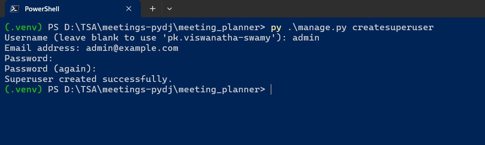

# Meetings using Python, and Django

I am learning Meetings Application using Python Django from different Video Courses, Books, and Websites.

## Few Commands

```powershell
python -m venv .venv
.\.venv\Scripts\activate

python.exe -m pip install --upgrade pip

py -m pip install Django~=5.0.7
django-admin startproject meeting_planner

cd meeting_planner
py .\manage.py runserver

py .\manage.py startapp website

py .\manage.py showmigrations
py .\manage.py migrate

py .\manage.py startapp meetings
py .\manage.py makemigrations
py .\manage.py showmigrations
py .\manage.py migrate
py .\manage.py sqlmigrate meetings 0001

py .\manage.py createsuperuser
```



## Reference(s)

> 1. <https://docs.python.org/3/library/venv.html>
